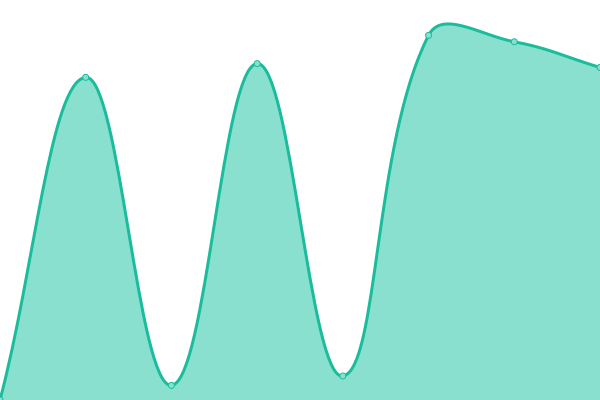

# [📈 Live Status](https://jjzhuo.github.io/site-availability): <!--live status--> **🟩 All systems operational**

This repository contains the open-source uptime monitor and status page for [jjzhuo](https://jjzhuo.github.io/site-availability), powered by [Upptime](https://github.com/upptime/upptime).

With [Upptime](https://upptime.js.org), you can get your own unlimited and free uptime monitor and status page, powered entirely by a GitHub repository. We use [Issues](https://github.com/jjzhuo/site-availability/issues) as incident reports, [Actions](https://github.com/jjzhuo/site-availability/actions) as uptime monitors, and [Pages](https://jjzhuo.github.io/site-availability) for the status page.

<!--start: status pages-->
<!-- This summary is generated by Upptime (https://github.com/upptime/upptime) -->
<!-- Do not edit this manually, your changes will be overwritten -->
<!-- prettier-ignore -->
| URL | Status | History | Response Time | Uptime |
| --- | ------ | ------- | ------------- | ------ |
|  [Landing](https://kindle-gpt.com) | 🟩 Up | [landing.yml](https://github.com/jjzhuo/site-availability/commits/HEAD/history/landing.yml) | 

 1983ms
     
 | 

<a href="https://jjzhuo.github.io/site-availability/history/landing">100.00%</a>
    

|  [Login](https://kindle-gpt.com/login) | 🟩 Up | [login.yml](https://github.com/jjzhuo/site-availability/commits/HEAD/history/login.yml) | 

 74ms
     
 | 

<a href="https://jjzhuo.github.io/site-availability/history/login">100.00%</a>
    

|  [Signup](https://kindle-gpt.com/signup) | 🟩 Up | [signup.yml](https://github.com/jjzhuo/site-availability/commits/HEAD/history/signup.yml) | 

 79ms
     
 | 

<a href="https://jjzhuo.github.io/site-availability/history/signup">100.00%</a>
    

<!--end: status pages-->

[**Visit our status website →**](https://jjzhuo.github.io/site-availability)

## 📄 License

- Powered by: [Upptime](https://github.com/upptime/upptime)
- Code: [MIT](./LICENSE) © [jjzhuo](https://jjzhuo.github.io/site-availability)
- Data in the `./history` directory: [Open Database License](https://opendatacommons.org/licenses/odbl/1-0/)
